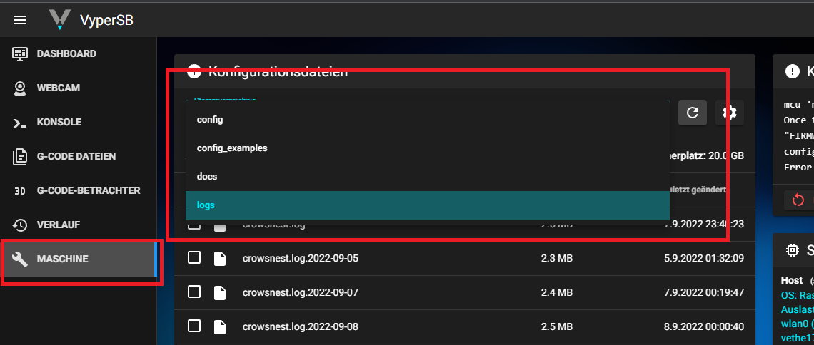

# Wo finde ich die Logdateien

* Mainsail Dashboard öffnen
* links unter Maschine
* in der oberen Hälfte steht „configs“
* linker Mausklick öffnet Dropdown
* „Logs“ auswählen

<figure><figcaption>
logfiles
</figcaption></figure>
