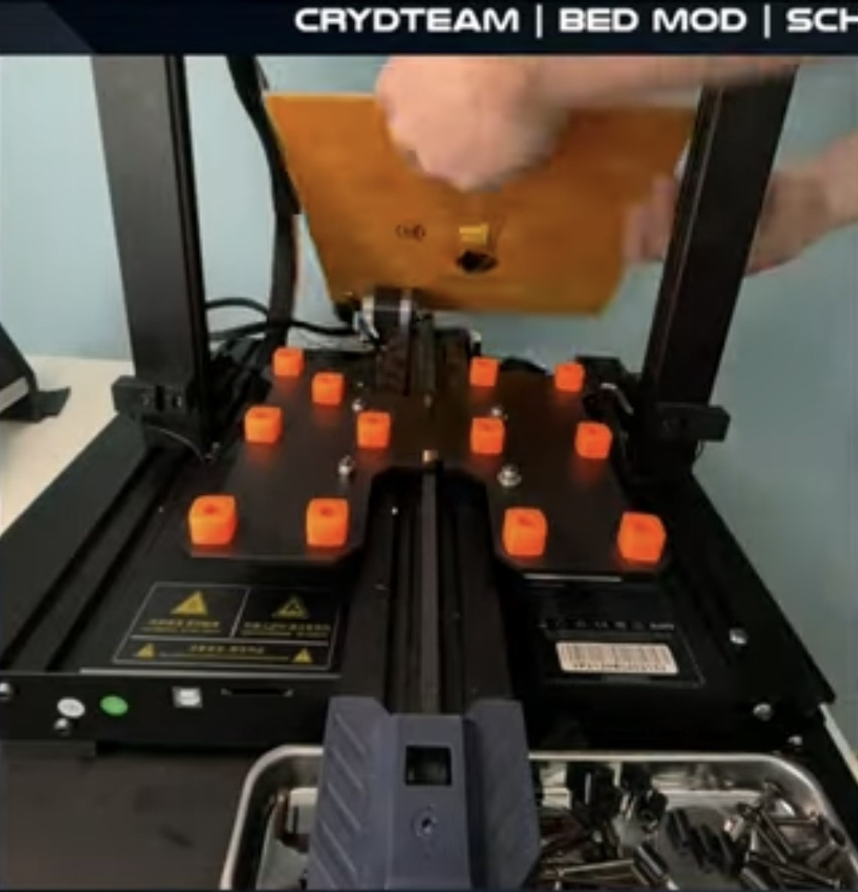

# Silkondämpfer einsetzten

* Schrauben lösen
* Bett abnehmen
* Alte Abstandshalter rausnehmen
* Silikondämpfer einsetzten
* Bett wieder festschrauben

<figure><figcaption>
Ja das Bild ist wirklich in schlechter Qualität
</figcaption></figure>
