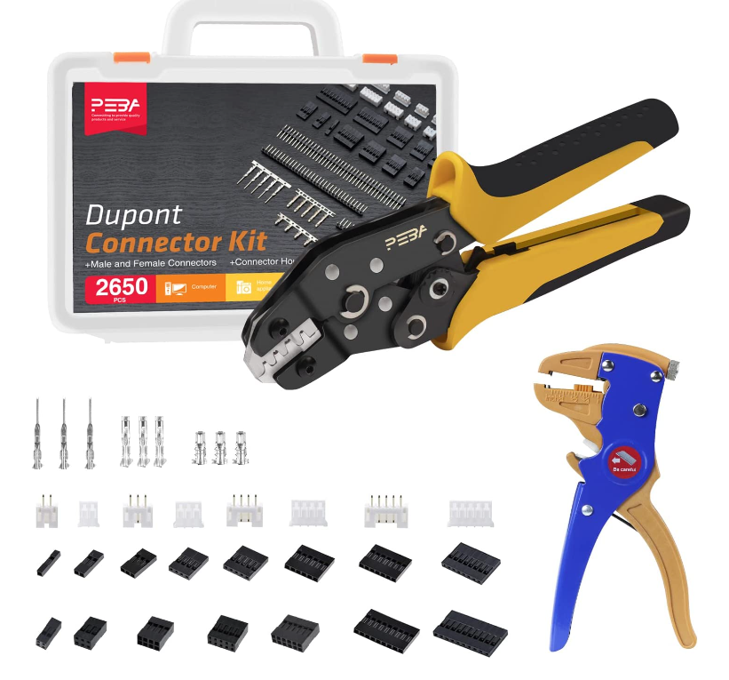

# Crimpwerkzeug

[Crimpset für JST XH und Dupont](https://www.youtube.com/redirect?event=video\_description\&redir\_token=QUFFLUhqbjlzV1R0Q1JlTVBRYnVkWVMzSnRsbjFUNEt2UXxBQ3Jtc0ttSWNqVUlwY0k3R0FYc2JRZHpwak9tWUR4RUJsclp4WDA5cDdnNnA5dXJrT2xVQkFSUlRTQVhoZ21hbmpxdWtMc0w0cGVKdmh1Qzlla2YyZUVqeWpvMWdHTTZ0Q29mRjhVVDcyYVhsSjhJcjVKX3c4MA\&q=https%3A%2F%2Famzn.to%2F3PFm8h5\&v=gSbswjLxbUg)

<figure><figcaption></figcaption></figure>

