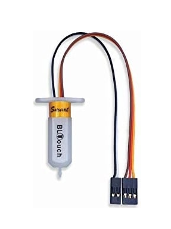

# Sensor

#### Für diese Modifikation wird ein sogenannter Bltouch Sensor benötigt.

<figure><figcaption>
Antclabs BL Touch
</figcaption></figure>

* [Günstige Variante](https://amzn.to/3tdm6nM)
* [Premium Variante](https://amzn.to/3zwgy9i)
