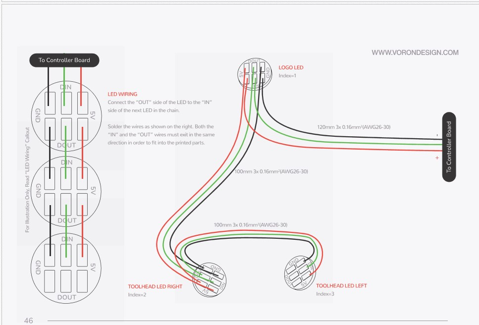

# Neopixel


_Die Orginale Anleitung ist hier zu finden:_\
[**Voron Stealthburner Assembly**](https://github.com/VoronDesign/Voron-Stealthburner/tree/main/Manual)****


<figure><figcaption></figcaption></figure>

<figure><figcaption></figcaption></figure>

<figure><figcaption></figcaption></figure>

<figure><figcaption></figcaption></figure>

<figure><figcaption></figcaption></figure>
