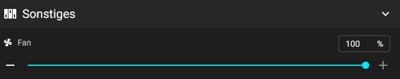

# Lüfter Test

### Hotend Lüfer

Um den Hotendlüfter ansteuern zu können muss der Extruder auf 60C aufgeheizt werden.

Danach könnt ihr auf dem Dashboard unter "Sonstiges" Extruder Fan sehen, wie sich das Lüfterrad dreht und die Prozentzahl auf 100% geht.

<figure><figcaption>
Extruder Fan Anzeige
</figcaption></figure>

### Bauteil Lüfter

Den Lüfter könnt ihr über den Schieberegeler oder einen Konsolenbefehl ansteuern.&#x20;

`M106 S255`

<figure><figcaption>
<code>Bauteil Lüfter Ansteuerung</code>
</figcaption></figure>

