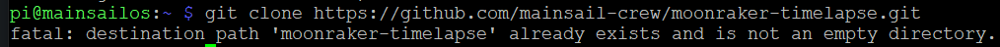

# Timelapse funktionert nach Update nicht mehr

1. Prüfen ob Timelapse schon auf dem Pi ist (SSH Verbindung aufbauen)

```
cd ~/
git clone https://github.com/mainsail-crew/moonraker-timelapse.git
```

<figure><figcaption></figcaption></figure>

2\. Timelapse updaten

```
cd ~/moonraker-timelapse
git pull
```

3\. Timelapse neu installieren

```
bash ~/moonraker-timelapse/install.sh
```

3\. Timelapse Update Manager in moonraker.conf überprüfen:

```
[update_manager timelapse]
type: git_repo
primary_branch: main
path: ~/moonraker-timelapse
origin: https://github.com/mainsail-crew/moonraker-timelapse.git
managed_services: klipper moonraker
```
