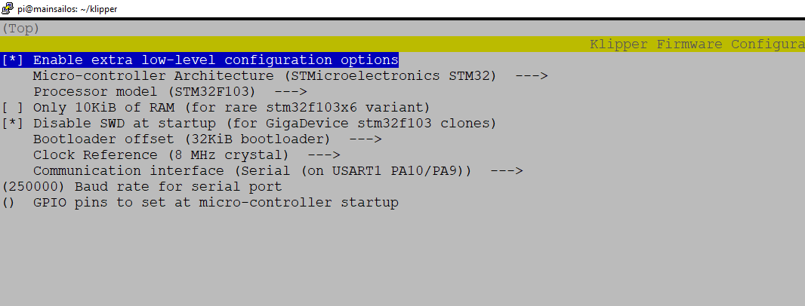

# Vyper Firmware aktualisieren / installieren

## Aktualisieren / Installieren

1. SSH Verbindung aufbauen (Putty) und Firmware erstellen

```
cd ~/klipper
```

```
make menuconfig
```

<figure><figcaption><p>Vyper firmware</p></figcaption></figure>

2\. Firmware auf SD Karte packen

* FTP Verbindung aufbauen (Filezilla, WinSCP) und klipper.bin downloaden\
  Die klipper.bin liegt in `/home/pi/klipper/out/klipper.bin`
*   SD Karte formatieren

    File System: **FAT32**

    Allocation Unit Size: **4096**
* klipper.bin auf SD Karte schieben und in "main\_board\_20220909.bin" um nennen.


Der Name der .bin muss sich immer zu der vorherigen Version der Zahlenkombination am Schluss unterscheiden. \
alt: 20220909  -> neu: 20220910


3\. Drucker Flashen

* Drucker ausschalten
* Verbindungskabel zum Pi abziehen
* SD Karte einstecken
* Drucker einschalten
* Drucker sollte akustisches Signal geben
* nach 30 Sekunden Drucker ausschalten, SD entfernen und Pi wieder verbinden.


``
