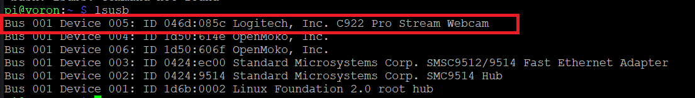

# Kein Bild der Webcam

* Prüfen ob das USB Gerät erkannt wird. \


```bash
lsus
```

Die Ausgabe sollte nun die Kamera anzeigen. Wenn nicht bitte prüfen, ob die Kamera generell an einem anderen Gerät funktioniert.

<figure><figcaption><p>lsusb</p></figcaption></figure>


*   Videogeräte prüfen\


    ```bash
    v4l2-ctl --list-devices
    ```

<figure><figcaption></figcaption></figure>


* crowsnest.conf prüfen\
  \- Ist der richtige Port eingestellt `8080`\
  \- Ist das richtige Gerät eingestellt `device: /dev/video0`


Die `Codeblöcke` müssen meist in Putty (SSH) ausgeführt werden.&#x20;

