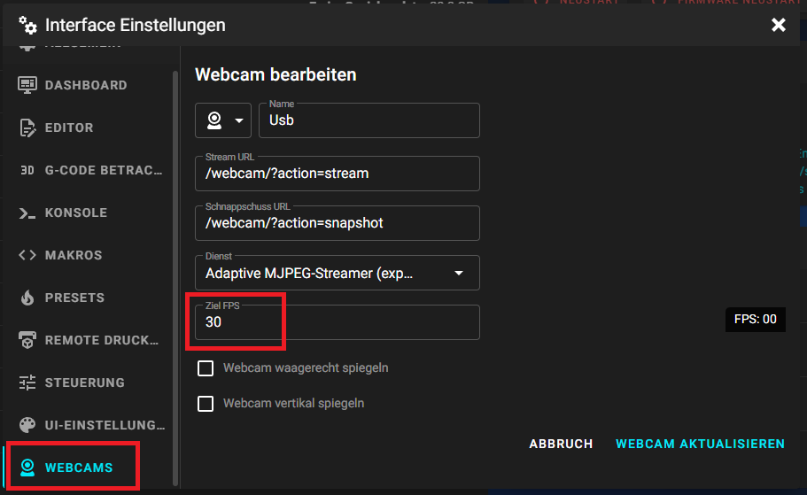

# Wenig FPS

### **Wenig FPS bei einer Webcam**

&#x20;

* WLAN Übertragung kann ein Problem sein -> Verbindet mal per LAN
* Mehrere Clients greifen parallel auf die Kamera zu
* Erhöhung der FPS in der crowsnest.conf (Neue Mainsail Version)\


```
[cam 1]
mode: mjpg                              # mjpg/rtsp
port: 8080                              # Port
device: /dev/video0                     # See Log for available ...
resolution: 640x480                     # widthxheight format
max_fps: 15                             # If Hardware Supports this it will be forced, ohterwise ignored/coerced.
```

> Resolution = Auflösung -> Habt ihr bei euch eine HD Auflösunge (1920x1080) eingetragen, kann es helfen diese auf 640x480 zu setztenqu

> max\_fps = Ihr könnt diese FPS mal auf 30 oder 60 hochsetzen&#x20;


Ebenfalls könnt ihr auf dem Mainsail Dashboard in den Einstellungen unter Webcam Einstellungen die FPS mal höher stellen.


<figure><figcaption><p>Dashboard / Einstellungen / Webcam</p></figcaption></figure>
