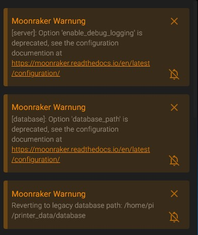
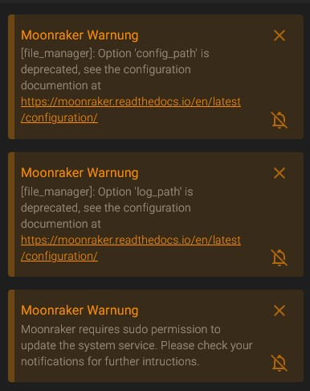
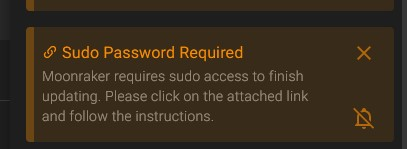

# Moonraker Probleme nach Update

Nach dem Moonraker Update zu Version _**v0.7.1-714-g3ad7d06**_ habt ihr folgende Fehler und seht eure Gcodes und Configs nicht mehr




## _**Wie bearbeite ich jetzt die moonraker.conf?!**_

_**1. FTP Client**_\
_****-> Über FTP Client (Filezilla, WinSCP) home/pi/klipper\_config/moonraker.conf per Drag\&Drop auf den Pc und bearbeiten. Danach wieder per Drag\&Drop hochlanden_

_**2. Putty**_

_`cd klipper_config` ; `nano moonraker.conf` ; STRG+X ; Y -> Enter_\
__\
__

## _**Welche Fehler sind zu beheben.**_

#### **1.   \[server] anpassen**

```
[server]
host: 0.0.0.0
port: 7126
# enable_debug_logging: False
```


"enable\_debug\_logging:" auskommentieren oder löschen


#### **2.   \[database] anpassen**

```
#[database]
#database_path:
```


\[database] komplett auskommentieren oder löschen


#### **3.   \[filemanager] anpassen**

<pre><code>[file_manager]
<strong>#config_path: ~/klipper_config
</strong>#log_path: ~/klipper_logs</code></pre>


"config\_path:" und "log\_path:" auskommentieren oder löschen



#### **4.   \[maschine] hinzufügen**

```
[machine]
sudo_password: MEINPASSWORT1234
```


Komplette Sektion \[maschine] mit sudo Passwort hinzufpügen.\
Dein Sudo Passwort ist das Passwort was du zum einloggen in den pi eingibst



## Angepasste moonraker.conf

\
Unsere angepasste moonraker.conf findet ihr wie immer auf dem Github.\



Quelle moonraker.conf


#### &#x20;

