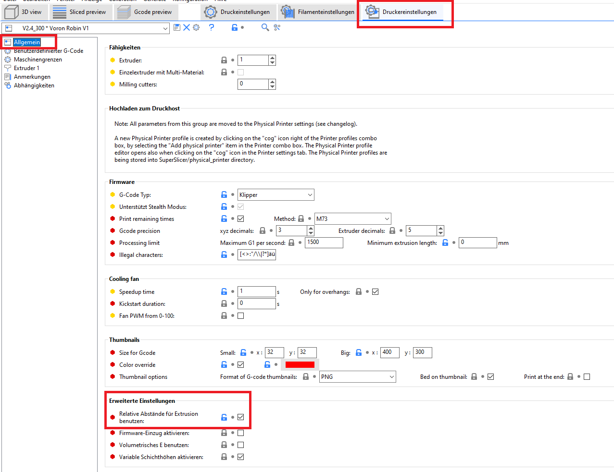

# Relative Extrusion aktivieren

## Superslicer:

Druckereinstellungen/Allgemein

<figure><figcaption>
Relative Abstände
</figcaption></figure>


Ihr könnt auch oben das "Lupensymbol" benutzten und "relative" Suchen


<figure><figcaption></figcaption></figure>
