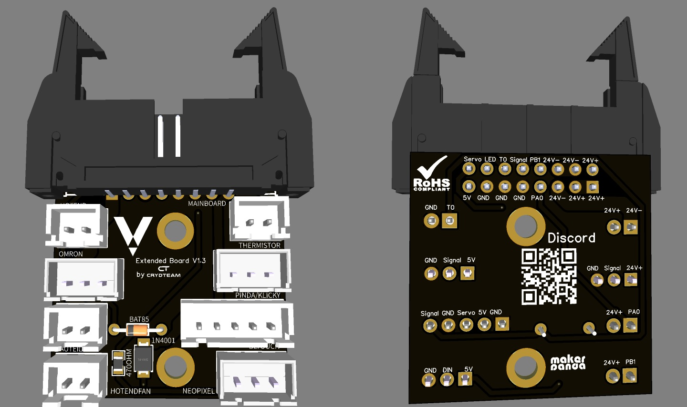

# Stecker Crimpen

* Es wird eine Crimpzange für JST XH benötigt. ([Rev-Link zu einer Zange](https://amzn.to/3egDX7X))


Wichtig! Bei allen Steckern die Pinbelegung beachten. Auf der Rückseite des Boards sind alle Belegungen aufgedruckt.



Das folgende Bild dient nur zur Darstellung. Die Belegungen können je nach Version des Boards variieren


<figure><figcaption></figcaption></figure>
