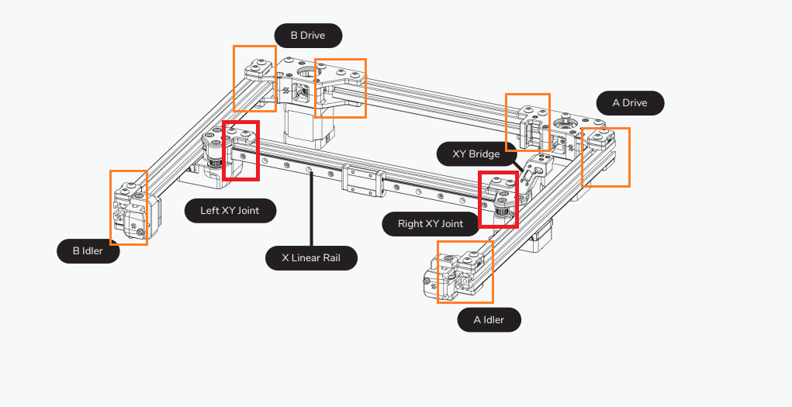

# Ganty Entspannen

## Wie entspanne (deracke) ich die Gantry vom Voron 2.4

#### 1. Aufheizen:

Heize deinen Drucker über einen längeren Zeitraum (\~2h) über das Heizbett auf. Deaktiviere dabei den Exhaust Fan, sodass keine Luft rausgezogen wird.\
_Wenn ein Nevermore vorhanden ist, kann dieser zur Luftumwälzung gerne eingesetzt werden_\

#### 2. Schrauben lösen:

#### Löse alle M5 Schrauben, welche die x Extrusion an der X/Y Join2 halten. Etwa 2-3 Umdrehung _Oben und unten nicht vergessen_

<figure><figcaption>
<em>Quelle Voron Manual V2.4r2</em>
</figcaption></figure>

#### 3. Gantry entspannen

An allen Gantry Extrusions kräftig wackeln. Gerne auch etwas drehen, sodass sich sämtliche Spannungen lösen können. Das Material kennt dann schon den Weg. Ich mach immer x zuerst. Scharuben natürlich nach jeder Extrusion wieder anziehen. \
__

#### 4. Linearführungen X Gantry entspannen:

Das gleiche dann mit den Linearführungen. Hotend ganz nach rechts, dann von links anfangen die Schrauben zu lösen. bis leicht über die Mitte.

<figure><figcaption></figcaption></figure>

#### 5.

An dem Hotend und der Railwackeln und von innen nach aussen anziehen. Typischer Hausmannsfehler ist hier auch das "Anzerren" einfach handfest reicht \
\
3: Wackel mal mal kräftig an allen Gantry Extrusions. Auch etwas drehen, hin und her. Das Material kennt dann schon den Weg. Ich mach immer x zuerst. Scharuben natürlich nach jeder Extrusion wieder anziehen. 4: Das gleiche dann mit den Linearführungen. Hotend ganz nach rechts, dann von links anfangen die Schrauben zu lösen. bis leicht über die Mitte. 5: An dem Hotend und der Railwackeln und von innen nach aussen anziehen. Typischer Hausmannsfehler ist hier auch das "Anzerren" einfach handfest reicht 6: Diese Enspannen dann auch jeder Achse. Mit ner Stunde Arbeit kriegste nen 350er locker unter 5 hundertstel, min zu max.
