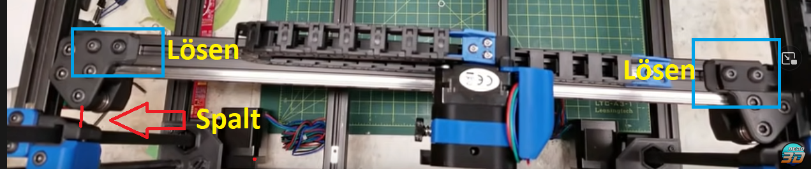
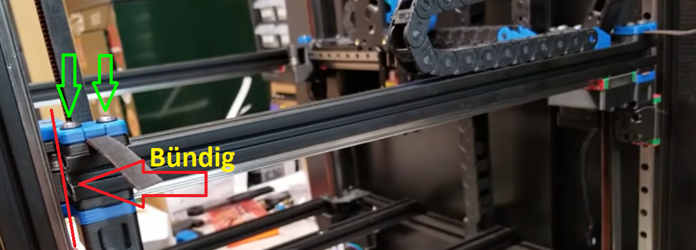
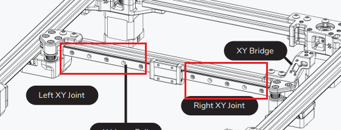

# Ganty Entspannen / Deracken

## Wie entspanne (deracke) ich die Gantry vom Voron 2.4

Quelle: [Youtube Nero 3D - "Solving Gantry Racking"](https://www.youtube.com/watch?v=cOn6u9kXvy0)

### 1. Aufheizen:

Heize deinen Drucker über einen längeren Zeitraum (\~2h) über das Heizbett auf. Deaktiviere dabei den Exhaust Fan, sodass keine Luft rausgezogen wird.\
_Wenn ein Nevermore vorhanden ist, kann dieser zur Luftumwälzung gerne eingesetzt werden_

__

### _2. Riemen entspannen_

Stelle den Druckkopf mittig und entspannte die X und Y Riemen über die dementsprechenden Spanner. Ggf. sogar die Klemmung an der X-Gantry auf einer Seite lösen und die Riemen ein Stück rausziehen. Am allerbesten ist natürlich eine komplette Herausnahme der Riemen.\

### _3. Gantry in der Höhe ausrichten:_

Richte die Gantry in allen vier Z-Position in identischer Höhe aus. Dazu kannst du gerne ein Zollstock oder Lineal nehmen. Es sollte ein starres Messmittel sein.\

\

### 2. Entspannen des hinteren Frames

Löse die an den Stellen markierten M5 Schrauben. \
Danach wackele etwas an dem Frameteil und bewege die Gantry mehrfach vor und zurück.\
Wenn sich die Gantry gut und "leicht" bewegen lässt, drehe eine der Schraube leicht fest.


Untere Schrauben nicht vergessen.


### 3. Gantry auf "Verkantung / racking" kontrollieren

<figure><figcaption>
Quelle Youtube Nero 3D - "Solving Gantry Racking"
</figcaption></figure>

Wenn du wie hier im Bild einen Spalt auf einen der beiden Seiten entdeckst ist deine Gatry verkantet. Um dies zu beheben, musst du die in blau markierten Schrauben lösen.&#x20;


_Denke auch hier bitte an die unteren Schrauben_&#x20;


### 4. Verkantung lösen

Bewege die Gantry in gegensätzlicher Richtung einfach hin und her. Du kannst auch gerne mal dran rütteln.\
&#x20;1\
Wenn du das getan hast, ziehe die Gantry wieder nach vorne zu dir. Hast du immer noch ein Spalt wieder etwas wackeln. Dies machst du so lange, bis du keinen Spalt mehr hast.\
\
Hast du es vorne gut ausgerichtet fahre die Gantry auch mal ganz nach hinten und überprüfe dort ebenfalls auf einen Spalt. Wenn einer vorhanden ist, weißt du ja was zu tun ist. \
\
Alles so lange Wiederholen bis vorne und hinten für dich perfekt sind.\
__

### 5. Schrauben festziehen.

Hast du jetzt deine Gantry schön ausgerichtet ziehe bitte auf jeder Seite erstmal eine Schraube handfest an und bewege nochmals zur Kontrolle die Gantry mehrfach vor und zurück.

Läuft alles zufriedenstellend kannst du alle Schrauben (auch die unteren und die des starren X-Frames) festziehen. Immer daran denken. Nach zu kommt ab.

### 6. Optionale Kontrollen

#### Y-Frame Ausrichten

Du solltst ebenfalls die Y-Frame auf "Bündigkeit" überprüfen

<figure><figcaption>
Quelle Youtube Nero 3D - "Solving Gantry Racking"
</figcaption></figure>

Sind diese nicht bündig solltest die in grün markierten Schrauben auf beiden Seiten sowie unterhalb lösen und ausrichten.

#### Linearführungen _X Gantry_ entspannen:

Du könntest ebenfalls noch deine Linearführung kontrollieren

Hierzu das Hotend ganz nach rechts und dann von links anfangen die Schrauben zu lösen.&#x20;

Am Hotend und der Rail wackeln und von innen nach außen anziehen. \
\
Als schönen Beobachtungspunkt könnt ihr die beiden Pully (Umlenkungen) rechts und links verwenden, um zu beobachten, ob sich der Riemen hoch oder runter auf dem Pully bewegt. Ist dies der Fall, solltet ihr die Rail nochmals auf gleichmäßige Ausrichtung kontrollieren.\
\
(_Hier kann zur Rail Ausrichtung gerne folgende STL verwendet werden_ [_MGN12_](https://github.com/VoronDesign/Voron-2/blob/Voron2.4/STLs/Tools/MGN12\_rail\_guide\_x2.stl) _/_ [_MGN9_](https://github.com/VoronDesign/Voron-2/blob/Voron2.4/STLs/Tools/MGN9\_rail\_guide\_x2.stl)_.)_

<figure><figcaption>
<em>Quelle Voron Manual V2.4r2</em>
</figcaption></figure>


Ihr solltet hier das Rail handfest anziehen. Rails müssen nicht "angeknallt" werden.


### 7. Riemen wieder spannen

Hast du alles perfekt ausgerichtet, solltest du deine Riemen wieder spannen. Dies macht jeder auf seine Art und Weise. In diese Guide gehen wir hier nicht näher darauf ein. \
\
Sind deine Riemen nun wieder gespannt, fahre den Druckkopf mittig und bewege die Gantry vor und zurück.\
Dabei sollte sich der Kopf kaum bis eigentlich gar nicht nach links und rechts bewegen.\
\

### Wir hoffen dass du nun bessere Druckergebnisse erzielen kannst.

[C_rydteam_](https://www.youtube.com/c/Crydteam)__

## Quellen:


Quelle Youtube Nero 3D - "Solving Gantry Racking"


[Voron 2.4 Manual ](https://github.com/VoronDesign/Voron-2/tree/Voron2.4/Manual)
