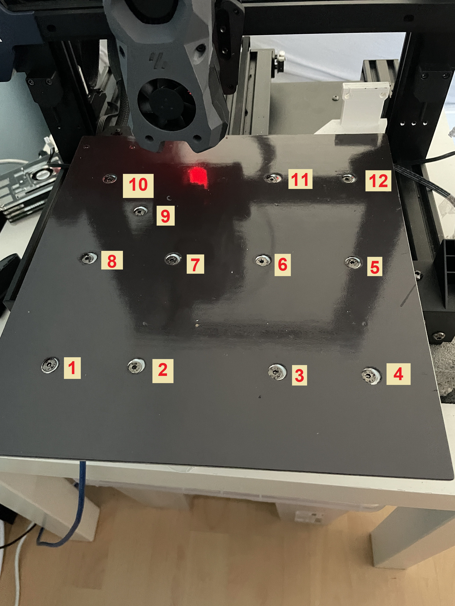

# Bed Mod



### Vorgehensweise:

Hier habt ihr mehrere Möglichkeiten:

* Löcher ausstanzen und dann so lassen (so machen es die Meisten)
* Folie komplett ab, Dämpfer einsetzen, Folie wieder rauf. Funktioniert wohl auch gut (selbst nicht gemacht, daher selbst ausprobieren)
* Folie komplett ab, Dämpfer einsetzen und am Ende eine neue Folie rauf&#x20;

\------------------------------------------------------------------

1. Schablonen drucken und ggf. die Dämpfer kürzen.
2. Mit dem Lochstanzer dann die Löcher sanft ausstanzen
3. Bett vorsichtig herunternehmen und die Spacer durch Dämpfer austauschen. Welche ihr austauscht und wie viel ist euch überlassen.
4. Bed wieder rauf
5. Mit `SCREW_TILT_CALIBRATION` oder `BED_MESH_CALIBRATE` die Schrauben justieren.\
   (Wie empfehlen Screw tilt fürs grobe und so schnell wie möglich auf Bed Mesh)


Z-Tilt nicht vergessen


<figure><figcaption></figcaption></figure>

### Schraubenpositionen

<figure><figcaption></figcaption></figure>
