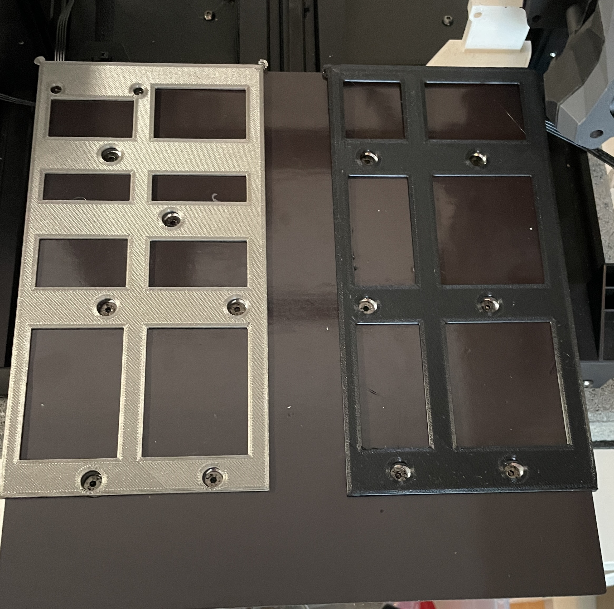

# Löcher ausstanzen

Mit dem [Lochstanzer](../hardware.md) dann die Löcher sanft ausstanzen.

<figure><figcaption>
Schablonen auflegen
</figcaption></figure>

<figure><figcaption>
So soll es aussehen
</figcaption></figure>

<figure><figcaption>
Übersicht der Schraubenabstände
</figcaption></figure>
