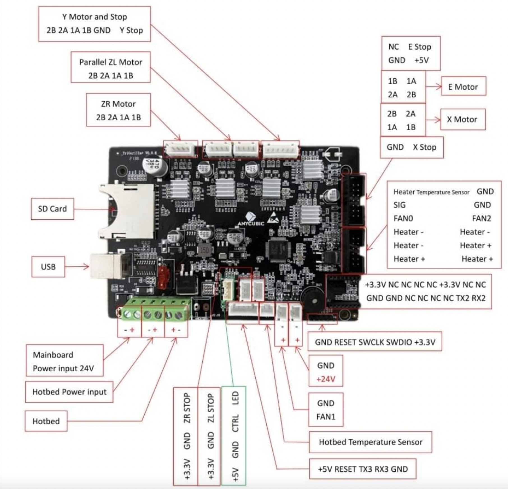

# Pinouts

#### Sehr gut erstellte Doku



<div>

<figure><figcaption></figcaption></figure>

 

<figure><figcaption></figcaption></figure>

</div>

```
CPU Pin    Port/pin name    Steppers/Drivers    
11    PC3    X_ENABLE    
10    PC2    X_STEP    
57    PB9    X_DIR    
            
2    PC13    Y_ENABLE    
61    PB8    Y_STEP    
59    PB7    Y_DIR    
            
3    PC14    ZL_ENABLE    
58    PB6    ZL_STEP    
57    PB5    ZL_DIR    
            
4    PC15    ZR_ENABLE    (ZR is E1 in pins definitions)
8    PC0    ZR_STEP    
9    PC1    ZR_DIR    
            
50    PA15    E0_ENABLE    
56    PB4    E0_STEP    
55    PB3    E0_DIR    
            
        Fan outputs    
14    PA0    FAN_PIN    
49    PA14    FAN1_PIN    (Controller fan)
27    PB1    E0_AUTO_FAN    
            
        Heater outputs    
15    PA1    HEATER0    
20    PA4    HEATER_BED    
41    PA8    HEATER1    
            
        Sensor inputs    
21    PA5    FILAMENT_RUNOUT    
22    PA6    POWER_MONITOR_VOLTAGE    
24    PC4    TEMP0    
26    PB0    TEMP_BED    
            
        Limit switch inputs    
23    PA7    X_MIN    
25    PC5    Y_MIN    
28    PB2    ZL_MIN    
37    PC6    ZR_MIN    
            
        Other    
42    PA9    SERIAL_TX    (Usart 0, to CH340 USB serial)
43    PA10    SERIAL_RX    
29    PB10    LCD_TX    (Usart 2)
30    PB11    LCD_RX    
16    PA2    WiFi_TX    (Usart 1)
17    PA3    WiFi_RX    
35    PB14    WiFi enable/power    
33    PB12    AUTO_LEVEL_RX    
34    PB13    AUTO_LEVEL_TX    
44    PA11    USB_D    (Unused?)
45    PA12    USB_P    (Unused?)
36    PB15    BEEPER    (output)
46    PA13    CASE_LIGHT    (output)
            
        SD card    
38    PC7    SD_DETECT    
39    PC8    SDIO_D0    
40    PC9    SDIO_D1    
51    PC10    SDIO_D2    
52    PC11    SDIO_D3    
53    PC12    SDIO_CLK    
54    PD2    SDIO_CMD    
```
