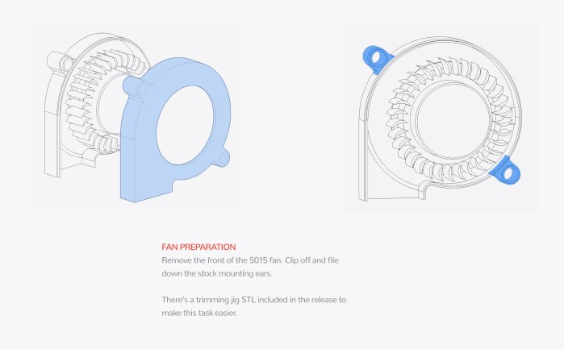

# Radial-Lüfter


_Die Orginale Anleitung ist hier zu finden:_\
[**Voron Stealthburner Assembly**](https://github.com/VoronDesign/Voron-Stealthburner/tree/main/Manual)****


<figure><figcaption>
Deckel abnehmen und Laschen entfernen
</figcaption></figure>

<figure><figcaption>
Einsetzten und Verschrauben
</figcaption></figure>
