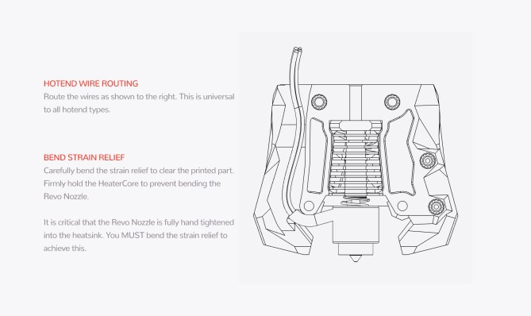
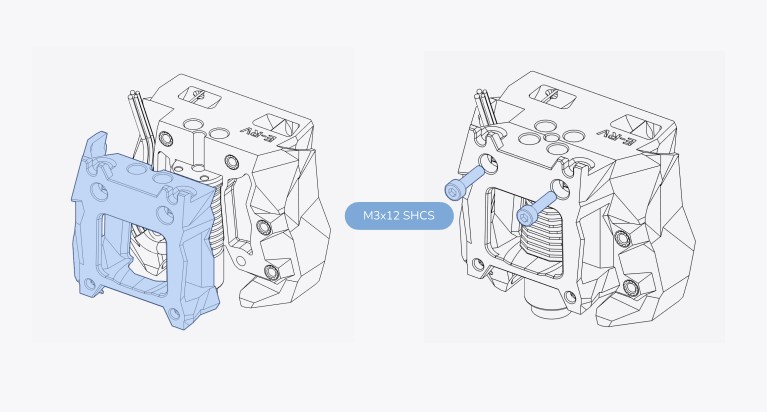
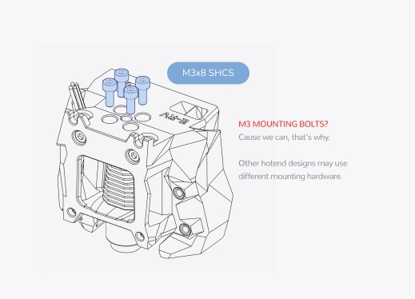
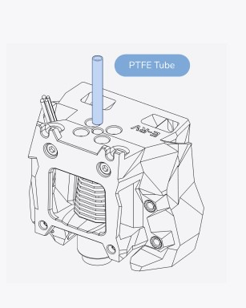

# Hotend


_Die Orginale Anleitung ist hier zu finden:_\
[**Voron Stealthburner Assembly**](https://github.com/VoronDesign/Voron-Stealthburner/tree/main/Manual)****


<figure><figcaption>
Toolhead Kabelfürhung
</figcaption></figure>

<figure><figcaption>
<strong>Toolhead Vorder-und Rückseite zusammenschraube</strong>
</figcaption></figure>

 

<figure><figcaption>
Hotend befestigen
</figcaption></figure>

 

<figure><figcaption>
PTFE einsetzten
</figcaption></figure>

