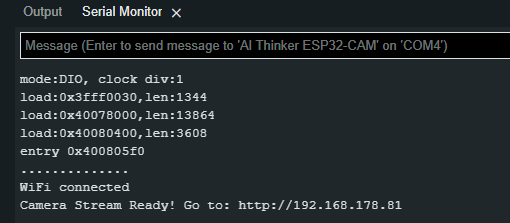

# Flashing

Jetzt verbindest du deinen FTDI mit einem USB deines PCs und startest den Flashvorgang wiefolgt:

<figure><figcaption>
Board Typ auswählen (hier musste ich sehr weit runter scrollen)
</figcaption></figure>

<figure><figcaption>
COM Port wählen
</figcaption></figure>

Starte nun den Flash Vorgang mit dem Pfeil

<figure><figcaption></figcaption></figure>

Dein Ergebnis sollte wiefolgt aussehen:

<figure><figcaption></figcaption></figure>

Öffne jetzt den Serial Monitor

<figure><figcaption></figcaption></figure>

Jetzt musst du die Brücke entfernen und den RST Button auf der Cam drücken

Hier bekommst du dann folgende Ausgabe:

<figure><figcaption>
IP Adresse notieren
</figcaption></figure>
